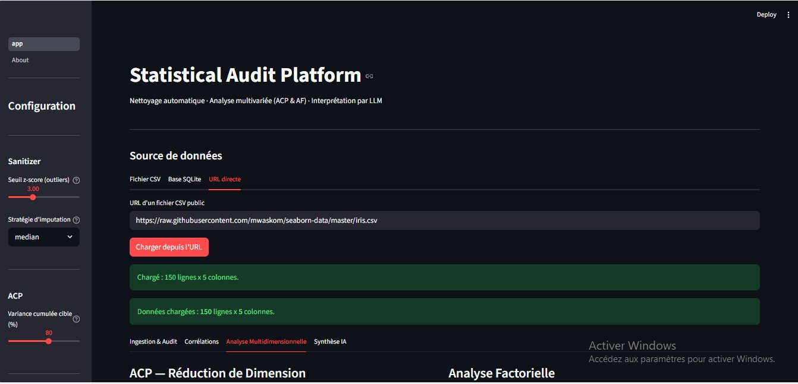
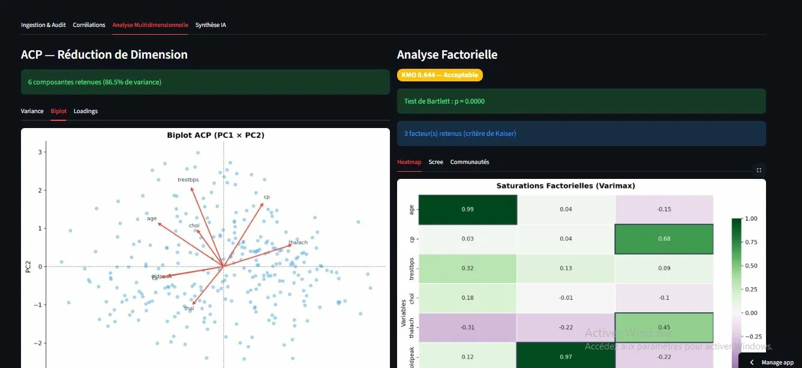
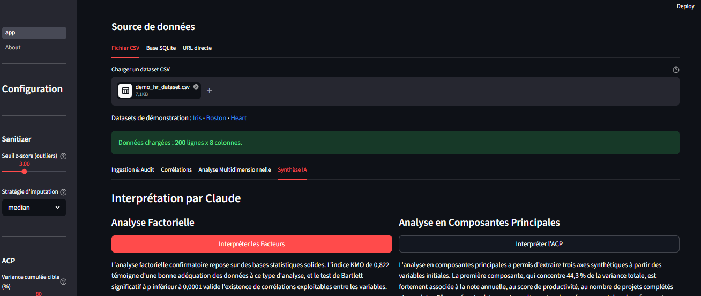

# Statistical Audit Platform

Plateforme d'audit statistique automatisée — chargement multi-source (CSV, SQLite, URL), nettoyage de données, analyse multivariée (ACP, Analyse Factorielle) et interprétation par LLM via Claude (Anthropic).

Demo live : https://stat-audit-eliezer.streamlit.app
GitHub : https://github.com/eliezermoise63-glitch/stat-audit-platform


---

## Aperçu







---

## Ce que fait ce projet

Quelle que soit la source de données choisie (CSV, SQLite ou URL), le pipeline de traitement est identique — la source est abstraite dès l'ingestion en un DataFrame pandas.

| Etape | Module | Ce qui se passe |
|-------|--------|-----------------|
| 1. Ingestion multi-source | app.py | CSV upload, base SQLite avec requête SQL personnalisée, ou URL directe |
| 2. Fiabilisation | core/sanitizer.py | Suppression colonnes constantes, imputation médiane, suppression outliers z-score |
| 3. Corrélations | core/engine.py | Matrice de Pearson avec p-values, masquage non-significatif |
| 4. ACP | core/engine.py | Sélection automatique des composantes par variance cumulée, biplot, loadings |
| 5. Analyse Factorielle | core/engine.py | Validation KMO et Bartlett, critère de Kaiser, rotation Varimax, communautés |
| 6. Synthèse LLM | utils/llm.py | Prompts structurés vers Claude pour interprétation métier en langage naturel |

---

## Fonctionnalités clés

- Chargement multi-source : fichier CSV, base SQLite avec requête SQL personnalisée, URL directe
- Nettoyage automatique : valeurs manquantes, outliers, variables non informatives
- ACP avec sélection automatique du nombre de composantes (seuil de variance configurable)
- Analyse Factorielle validée statistiquement (KMO, Bartlett) avec rotation Varimax
- Matrice de corrélation avec masquage automatique des corrélations non significatives
- Interprétation en langage naturel par Claude — séparation claire entre inférence statistique et LLM
- Interface interactive Streamlit avec configuration en temps réel (sidebar)
- 53 tests unitaires et d'intégration, CI/CD GitHub Actions

---

## Sources de données supportées

### Fichier CSV
Upload direct depuis votre machine. Séparateur auto-détecté (virgule, point-virgule, tabulation).

### Base SQLite
Uploadez un fichier .db ou .sqlite, l'app liste automatiquement les tables disponibles et vous permet d'écrire une requête SQL personnalisée.

```sql
-- Exemples de requêtes
SELECT * FROM employes
SELECT age, salaire, satisfaction FROM employes WHERE anciennete > 2
SELECT * FROM clients LIMIT 500
```

Pour générer une base SQLite de démonstration :
```bash
python assets/demo_data_generator.py --sqlite
```

### URL directe
Collez une URL pointant vers un fichier CSV public. Exemples :
- https://raw.githubusercontent.com/mwaskom/seaborn-data/master/iris.csv
- https://raw.githubusercontent.com/selva86/datasets/master/BostonHousing.csv
- https://raw.githubusercontent.com/sharmaroshan/Heart-UCI-Dataset/master/heart.csv

---

## Démarrage rapide

Prérequis : Python 3.10 ou supérieur. Clé API Anthropic optionnelle (onglet Synthèse IA uniquement).

```bash
git clone https://github.com/eliezermoise63-glitch/stat-audit-platform.git
cd stat-audit-platform

python -m venv .venv
source .venv/bin/activate      # Linux/macOS
# .venv\Scripts\activate       # Windows

pip install -r requirements.txt
streamlit run app.py
```

Configuration de la clé API :

```bash
cp .streamlit/secrets.toml.example .streamlit/secrets.toml
# Editez .streamlit/secrets.toml :
# ANTHROPIC_API_KEY = "sk-ant-votre-cle-ici"
```

Sans clé : les 3 premiers onglets fonctionnent normalement. Seul l'onglet Synthèse IA est désactivé.

---

## Architecture

```
stat-audit-platform/
├── app.py                      # Point d'entrée Streamlit (4 onglets)
├── core/
│   ├── sanitizer.py            # Pipeline de fiabilisation des données
│   └── engine.py               # Moteur ACP + Analyse Factorielle + Corrélations
├── utils/
│   ├── charts.py               # Visualisations matplotlib/seaborn
│   └── llm.py                  # Interface Claude (Anthropic)
├── assets/
│   └── demo_data_generator.py  # Génère CSV et SQLite de démonstration
├── tests/                      # 53 tests unitaires et d'intégration
└── .github/workflows/ci.yml    # CI GitHub Actions (Python 3.10 et 3.11)
```

---

## Détails techniques

**DataSanitizer**

```
Source (CSV / SQLite / URL)
    -> DataFrame pandas (abstraction commune)
    -> Sélection colonnes numériques
    -> Suppression colonnes constantes (nunique <= 1)
    -> Suppression colonnes quasi-constantes (ratio < 1%)
    -> Imputation médiane robuste
    -> Suppression lignes outliers (|z-score| > seuil configurable, défaut 3)
DataFrame fiabilisé + SanitizationReport traçable
```

**MultivariateEngine**

ACP : standardisation obligatoire (StandardScaler), sélection automatique des composantes par variance cumulée (seuil configurable, défaut 80%), biplot PC1 x PC2.

Analyse Factorielle : validation KMO (seuil 0.6) et test de Bartlett (p < 0.05), critère de Kaiser pour le choix automatique du nombre de facteurs, rotation Varimax, rapport de communautés par variable.

**SQLAlchemy**

La connexion SQLite utilise SQLAlchemy 2.0. pd.read_sql() retourne un DataFrame identique à pd.read_csv() — le pipeline en aval ne fait aucune différence entre les sources.

---

## Limites actuelles

| Limite | Impact | Priorité |
|--------|--------|----------|
| factor-analyzer incompatible avec scikit-learn >= 1.6 | Contournement en place (sklearn épinglé < 1.6) | Haute |
| SQLite uniquement (pas PostgreSQL, MySQL) | Bases distantes non supportées | Moyenne |
| Variables catégorielles ignorées | Perte d'information potentielle | Moyenne |
| Pas de cache Streamlit | Recalcul à chaque interaction | Moyenne |
| Rapport non exportable | Résultats non persistants | Basse |

---

## Roadmap

Court terme (v0.2) :
- Compatibilité scikit-learn >= 1.6
- Support PostgreSQL et MySQL via SQLAlchemy
- Cache Streamlit (@st.cache_data)
- Export PDF du rapport

Moyen terme (v0.3) :
- Clustering post-ACP : K-Means sur les composantes principales, choix automatique de K par méthode du coude et silhouette score
- ACM pour les variables catégorielles
- KNN Imputer en alternative à la médiane
- Isolation Forest en complément du z-score

Long terme (v1.0) :
- DBSCAN pour clusters de forme arbitraire
- Rapport automatique avec interprétation LLM incluse
- Comparaison de datasets avant/après traitement
- Tests de normalité intégrés (Shapiro-Wilk, Kolmogorov-Smirnov)

---

## Tests

```bash
pytest tests/ -v
pytest tests/ --cov=core --cov=utils --cov-report=term-missing
```

---

## Déploiement sur Streamlit Cloud

1. Pusher ce dépôt sur GitHub
2. Aller sur share.streamlit.io
3. Create app -> sélectionner ce repo -> fichier principal : app.py
4. Advanced settings -> Secrets -> ajouter ANTHROPIC_API_KEY
5. Deploy

---

## Pitch (30 secondes)

"J'ai développé une plateforme d'audit statistique automatisée. Elle accepte trois sources de données : fichier CSV, base SQLite avec requête SQL personnalisée, et URL directe. La source est abstraite dès l'ingestion — le pipeline de nettoyage, d'analyse multivariée (ACP + Analyse Factorielle validée par KMO et Bartlett) et d'interprétation par Claude est identique quelle que soit la source. La prochaine étape est un module de clustering K-Means sur les composantes ACP."

---

## Licence

MIT - Eliezer Moise